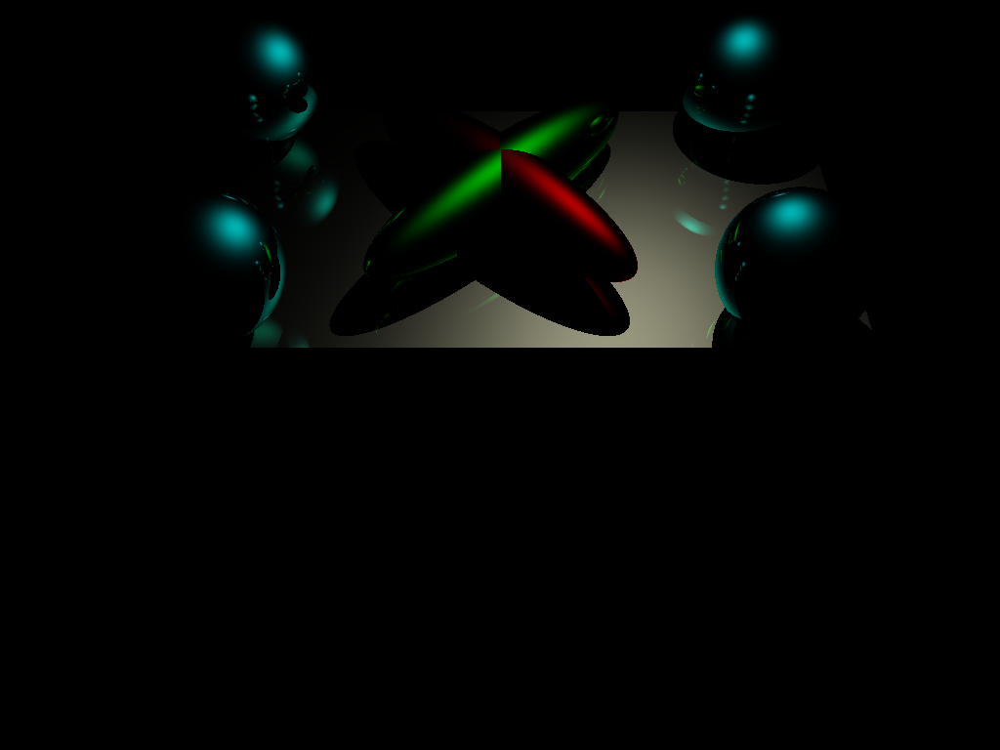
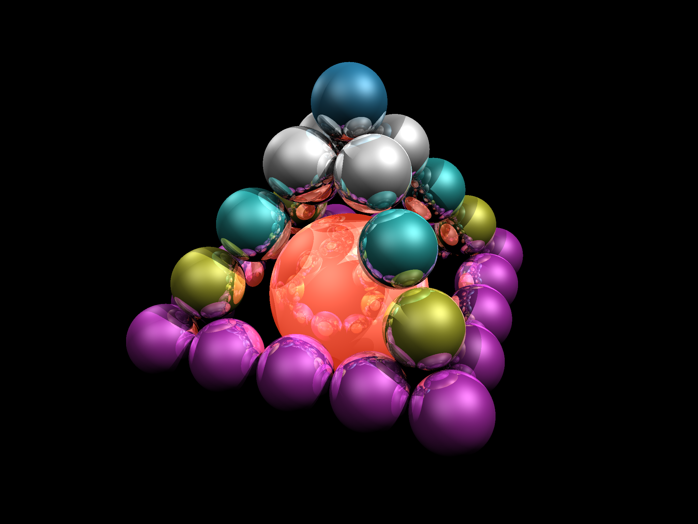
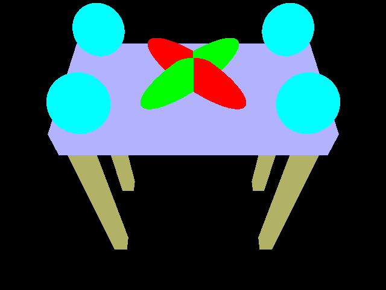
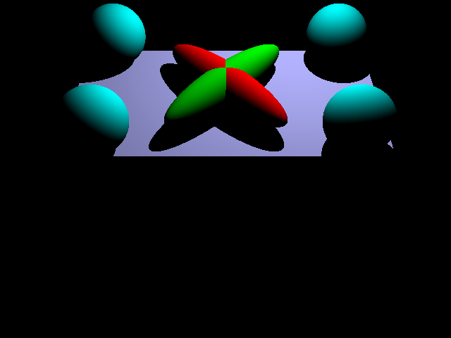
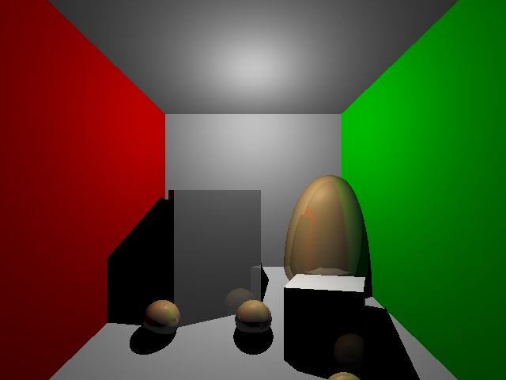

### Simple Raytracer

##### Chatzilygeroudis Konstantinos

#### README TO BE UPDATED

##### Needs C++11 compatible compiler

#### How to use:

###### Compile:

```bash
mkdir build && cd build
cmake ..
make
```

###### Run example scenes:

```bash
cd build
./Example ../scene-files/name_of_scene.test
```

###### Syntax of scenes files:

TO BE ADDED

#### Sample Images










